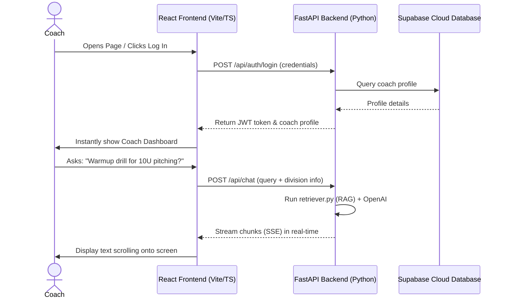

# Softball Coach AI: React & TypeScript Migration Roadmap

This document provides a beginner-friendly, step-by-step guide to converting your Streamlit application into a modern, highly responsive **React + TypeScript** web application. It also details how to set up and deploy both the frontend and backend to secure cloud environments completely **for free**.

---

## 🗺️ Architectural Comparison: Before vs. After

Before diving into the steps, let's look at how the execution models change. This is the core reason the app will feel faster and look more professional:

### 1. The Streamlit Monolith (Before)
* **How it works:** A single script that runs from top-to-bottom on the server.
* **The issue:** If a coach types a message or clicks a button, the entire script executes again. This causes lag, screen flashes, and requires complex state queues to avoid losing data.

### 2. The Decoupled Stack (After)
* **How it works:** 
  * The **Frontend (React)** runs entirely inside the coach's web browser. It only updates the parts of the screen that change.
  * The **Backend (FastAPI)** sits on a server, waiting for requests. It only runs when the frontend asks for data (like authenticating a login or querying the AI).



---

## 🛠️ Phase 1: Building the Backend (Python FastAPI)

FastAPI is a Python framework that lets you build fast APIs with minimal code. We will keep your existing AI and database logic and just wrap them in "endpoints" (URLs the frontend can talk to).

### Step 1.1: Install FastAPI & Server Tools
In your Python environment, install these additional libraries:
```bash
pip install fastapi uvicorn sse-starlette psycopg2-binary
```
* **fastapi:** The framework to handle web requests.
* **uvicorn:** The lightweight server that runs your API.
* **sse-starlette:** Allows streaming responses (words appearing one by one in chat).
* **psycopg2-binary:** Enables Python to connect to PostgreSQL (your new cloud database).

### Step 1.2: Create the API Entry Point (`src/main.py`)
Create a new file `src/main.py`. This script sets up the FastAPI server, handles CORS (allowing your React app to speak to it), and maps routes:

```python
from fastapi import FastAPI, Depends, HTTPException, status
from fastapi.middleware.cors import CORSMiddleware
from fastapi.responses import StreamingResponse
from pydantic import BaseModel, EmailStr
from src.retriever import build_chain
from src.database import authenticate_coach, register_coach

app = FastAPI(title="Softball Coach AI API")

# Enable CORS so your React frontend running on local host can talk to it
app.add_middleware(
    CORSMiddleware,
    allow_origins=["*"], # In production, swap with your Vercel URL
    allow_credentials=True,
    allow_methods=["*"],
    allow_headers=["*"],
)

# 1. Schemas (Data validation rules)
class LoginRequest(BaseModel):
    username: str
    password: str

class RegisterRequest(BaseModel):
    username: EmailStr
    password: str
    coach_name: str
    location: str
    age_group: str

class ChatRequest(BaseModel):
    question: str
    age_group: str
    coach_name: str
    location: str

# 2. Authentication API Routes
@app.post("/api/auth/register")
def api_register(data: RegisterRequest):
    success = register_coach(
        data.username, data.password, data.coach_name, data.location, data.age_group
    )
    if not success:
        raise HTTPException(status_code=400, detail="Username already exists.")
    return {"message": "Account created successfully!"}

@app.post("/api/auth/login")
def api_login(data: LoginRequest):
    user = authenticate_coach(data.username, data.password)
    if not user:
        raise HTTPException(status_code=401, detail="Invalid username or password.")
    return user

# 3. AI RAG Chat Route (Streaming response)
chain = build_chain()

@app.post("/api/chat")
def api_chat(data: ChatRequest):
    profile_context = (
        f"Directly advising Coach {data.coach_name} based in {data.location}. "
        f"Tailor advice for competitive {data.age_group} fastpitch players."
    )
    
    # Simple non-streaming wrapper (or use EventSource/SSE for token streaming)
    result = chain.invoke({
        "question": data.question,
        "profile_context": profile_context
    })
    return {
        "answer": result["answer"],
        "sources": [doc.metadata.get("source", "Unknown").split('/')[-1] for doc in result.get("source_documents", [])]
    }
```

To run your API locally, run this command in your terminal:
```bash
uvicorn src.main:app --reload
```
You can visit `http://127.0.0.1:8000/docs` in your browser to see a fully interactive test suite for your backend API!

---

## ⚛️ Phase 2: Building the Frontend (React + TypeScript)

We will use **Vite**, the industry standard tool for creating React applications. It sets up the development server, manages compiler configurations, and bundles your production files.

### Step 2.1: Initialize the Project
Open a new terminal window in your root directory and run:
```bash
# Initialize a new React project in a folder named 'frontend'
npm create vite@latest frontend -- --template react-ts
cd frontend
npm install
```

### Step 2.2: Install Styling & Icon libraries
We will install **Lucide React** for premium sports and UI icons:
```bash
npm install lucide-react
```

### Step 2.3: Build the UI Structure
A clean React structure splits your application into distinct, modular parts. Inside `frontend/src/`, organize your folders like this:

```
frontend/src/
├── components/
│   ├── AuthPortal.tsx      <-- Login & Register panel
│   ├── Sidebar.tsx         <-- Division selector & Practice Plan generator
│   └── ChatArea.tsx        <-- Main scrolling whiteboard & sources
├── App.tsx                 <-- Orchestrates views and session state
├── index.css               <-- Styling variables & resets
└── main.tsx                <-- Renders React onto the screen
```

### Step 2.4: Managing App-wide State (`App.tsx`)
In React, we manage who is logged in and what screen is visible using simple variables called `state`. Here is a beginner-friendly layout of your orchestrator:

```tsx
import React, { useState } from 'react';
import AuthPortal from './components/AuthPortal';
import Sidebar from './components/Sidebar';
import ChatArea from './components/ChatArea';
import { Trophy } from 'lucide-react';

export interface CoachProfile {
  username: string;
  coach_name: string;
  location: string;
  age_group: string;
}

function App() {
  const [user, setUser] = useState<CoachProfile | null>(null);
  const [isGuest, setIsGuest] = useState(false);

  const handleLogout = () => {
    setUser(null);
    setIsGuest(false);
  };

  // If the user hasn't logged in or chosen guest, show the Portal
  if (!user && !isGuest) {
    return (
      <AuthPortal 
        onLoginSuccess={(profile) => setUser(profile)} 
        onContinueAsGuest={() => setIsGuest(true)} 
      />
    );
  }

  return (
    <div className="app-container">
      {/* Top Banner Header */}
      <header className="app-header">
        <div className="header-title">
          <Trophy className="icon-gold" />
          <h1>Softball Coach AI</h1>
        </div>
        <div className="header-user">
          <span>{user ? `Coach ${user.coach_name}` : 'Guest Dugout'}</span>
          <button onClick={handleLogout} className="btn-secondary">Log Out</button>
        </div>
      </header>

      {/* Main Workspace split into Sidebar and Chat */}
      <div className="workspace">
        <Sidebar 
          currentDivision={user?.age_group || '12U Division'} 
          isGuest={isGuest} 
        />
        <main className="whiteboard-area">
          <ChatArea userProfile={user} />
        </main>
      </div>
    </div>
  );
}

export default App;
```

---

## 💾 Phase 3: Transitioning to persistent free Cloud Storage

To deploy for free, we must move away from **local files** (`softball_ap.db` and `/vectorstore`) because free hosts reset their hard drives frequently. We will use **Supabase** (a free cloud PostgreSQL database) to keep your coach accounts and vectors secure forever.

### Step 3.1: Set up Supabase (PostgreSQL) — **Always Free**
1. Go to [Supabase](https://supabase.com) and create a free account.
2. Create a new project named `Softball Coach AI`.
3. Go to **SQL Editor** in the Supabase dashboard and run this command to create your coaches table:
```sql
CREATE TABLE coaches (
    id SERIAL PRIMARY KEY,
    username VARCHAR(255) UNIQUE NOT NULL,
    password_hash VARCHAR(255) NOT NULL,
    coach_name VARCHAR(255) NOT NULL,
    location VARCHAR(255) NOT NULL,
    primary_age_group VARCHAR(50) NOT NULL,
    created_at TIMESTAMP WITH TIME ZONE DEFAULT CURRENT_TIMESTAMP
);
```
4. Copy your **Database Connection String** from project settings.

### Step 3.2: Connect your FastAPI backend to Supabase Postgres
Update your backend's database utility `src/database.py` to use Postgres instead of SQLite. Replace `sqlite3` functions with standard PostgreSQL adapters:

```python
import psycopg2
from psycopg2.extras import RealDictCursor
import os

DATABASE_URL = os.environ.get("DATABASE_URL") # Stored safely in cloud secrets

def get_db_connection():
    # Connects to your free Supabase cloud instance
    conn = psycopg2.connect(DATABASE_URL, cursor_factory=RealDictCursor)
    return conn

def register_coach(username, password, coach_name, location, age_group):
    conn = get_db_connection()
    cursor = conn.cursor()
    try:
        pwd_hash = hash_password(password)
        cursor.execute(
            """
            INSERT INTO coaches (username, password_hash, coach_name, location, primary_age_group)
            VALUES (%s, %s, %s, %s, %s)
            """,
            (username.lower().strip(), pwd_hash, coach_name.strip(), location.strip(), age_group)
        )
        conn.commit()
        return True
    except psycopg2.IntegrityError:
        return False
    finally:
        cursor.close()
        conn.close()
```

### Step 3.3: Set up Cloud Vectors (Pinecone) — **Free Tier**
Instead of holding heavy Chroma database folders locally:
1. Register for a free account at [Pinecone](https://pinecone.io).
2. Create a free vector index using standard dimensions (`3072` if using OpenAI's `text-embedding-3-small` embeddings).
3. In `src/retriever.py` and `src/ingest.py`, swap out the Chroma imports for Pinecone:
```python
from langchain_pinecone import PineconeVectorStore

# In retriever.py
vectorstore = PineconeVectorStore(
    index_name="softball-index", 
    embedding=embeddings,
    pinecone_api_key=os.environ.get("PINECONE_API_KEY")
)
```

---

## 🚀 Phase 4: Deploying Everything for Free

Once your code is updated, push your repository to **GitHub**. We will link your repository to these free cloud hosting systems:

### 1. The Frontend (React App) — Vercel
1. Go to [Vercel](https://vercel.com) and create an account (choose **Continue with GitHub**).
2. Click **Add New** > **Project** and select your GitHub repository.
3. Vercel automatically detects Vite + React:
   * **Root Directory:** If you created it inside a subfolder, specify `frontend`.
   * **Build Command:** `npm run build` (automatic).
   * **Output Directory:** `dist` (automatic).
4. Click **Deploy**. Within 60 seconds, your React app is live with a free custom SSL domain (e.g., `https://softball-coach-ai.vercel.app`)!

### 2. The Backend API (FastAPI) — Hugging Face Spaces (Docker)
Hugging Face Spaces provides **24/7 free containers** that never go to sleep.

1. Go to [Hugging Face](https://huggingface.co) and create a free account.
2. Click on your profile photo > **New Space**.
3. Name your space, and select **Docker** as the SDK. Choose the **Blank** template.
4. Set the space visibility to **Public** (the UI is open, but your secure environment secrets will remain private).
5. In your codebase, create a `Dockerfile` at the root directory:
```dockerfile
FROM python:3.9-slim

WORKDIR /app

COPY requirements.txt .
RUN pip install --no-cache-dir -r requirements.txt

COPY . .

# Run FastAPI server on Hugging Face's port 7860
CMD ["uvicorn", "src.main:app", "--host", "0.0.0.0", "--port", "7860"]
```
6. Commit and push this file.
7. Go to **Settings** in your Hugging Face Space, scroll to **Variables and Secrets**, and add your secure environment keys:
   * `OPENAI_API_KEY`: Your OpenAI developer key.
   * `DATABASE_URL`: Your Supabase PostgreSQL connection string.
   * `PINECONE_API_KEY`: Your Pinecone API key.
8. Hugging Face will build the Docker container and host your API at: `https://<your-username>-<your-space-name>.hf.space`.

---

## 🌟 Summary Checklist for Beginners

To execute this migration smoothly without getting overwhelmed:

1. **Keep it local first:** Don't try to build and deploy at the same time. Focus on making the backend FastAPI and React frontend talk to each other on your own computer first.
2. **Handle database last:** Develop using your existing SQLite database. Once the frontend UI is behaving perfectly, swap out SQLite for Supabase and upload your vectors to Pinecone.
3. **Commit often:** Keep your code clean, back up your progress to GitHub, and let Vercel handle the deployment pipeline automatically for you!
